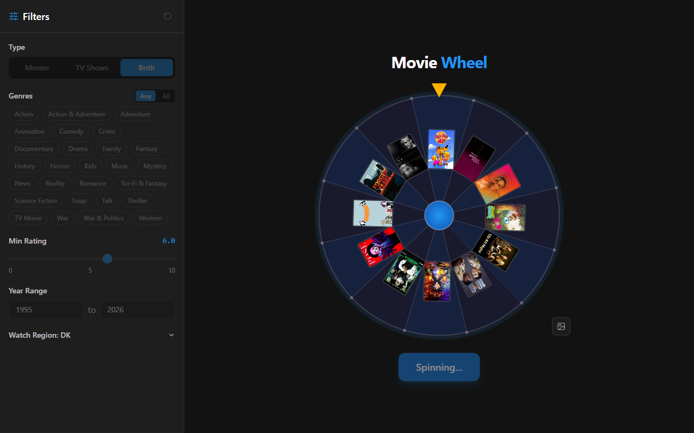
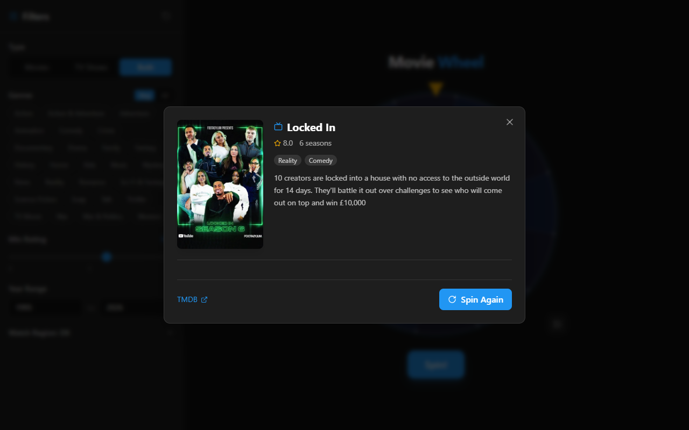

# MovieWheel

[](https://github.com/CMaintz/movie-wheel/actions/workflows/ci.yml)

"What do we watch tonight?" can eat a whole evening, so I handed the decision to a wheel. Set your filters, spin, and it picks a movie or TV show for you. Candidates come live from TMDB, and the result shows where you can stream the title in your region.

I spun it out of my [movie-db-webapp](https://github.com/CMaintz/movie-db-webapp) into its own repo, which is why the history starts with a single import commit.

Live: https://movie-wheel.cmaintz-site.workers.dev





## What it does

- Spin-the-wheel picker: a 12-slot game-show wheel on canvas (marquee bulbs, pegs and a flapper that ticks as they pass), with each title dressed as a VHS sleeve or DVD case. Spin with the button, the hub or <kbd>Space</kbd>
- Filters: media type (movie / TV / both), genres (match any or all), release year range, minimum rating, minimum vote count and original language, saved in `localStorage`
- Genre combos: Rom-Com, Horror Comedy, Action Thriller and a dozen more. A combo only matches titles that have both genres, and you can mix combos with plain genres
- Result details: runtime or season count, genres, director (or creator for TV), cast, trailer, and TMDB/IMDb links
- Watch providers: streaming, rent and buy options for the title in your region (detected from your time zone, and you can change it)
- Server-side TMDB proxy: in production the browser only calls `/api/tmdb/*`, and the API key stays on the server

## Tech Stack

- React 19 + TypeScript (strict), Vite, Tailwind CSS, TanStack React Query
- Cloudflare Workers (static assets + Worker for `/api/*`)
- Vitest + Testing Library, v8 coverage, GitHub Actions CI

## Architecture

```
Browser (React SPA)
   │  production: GET /api/tmdb/<path>?<query>          dev: calls TMDB directly
   ▼
Cloudflare Worker (worker/index.ts)
   │  thin adapter over a Fetch-API core: server/tmdbProxy.ts
   │   - origin check: same origin + ALLOWED_ORIGINS, anything else gets a 403
   │   - path allow-list: /genre, /discover, /movie, /tv, and every segment matches [A-Za-z0-9_-]
   │   - rate limit per client IP (60 req/min)
   │   - injects TMDB_API_KEY (or the TMDB_READ_TOKEN bearer), drops any client-supplied api_key
   ▼
api.themoviedb.org/3
```

```
src/
├── components/   Wheel (canvas), FilterPanel, ResultModal, WatchProviders
├── hooks/        useWheel (spin state machine), useFilters (persisted filter state)
├── services/     api.ts: TMDB calls, candidate selection
└── utils/        wheelMath (spin/landing angles), genreCombos, easing, region detection
server/           tmdbProxy.ts: platform-neutral proxy core
worker/           Cloudflare Worker entry (serves dist/ + proxies /api/*)
```

The wheel math lives in `utils/wheelMath.ts` as pure functions. A property test checks that the wheel lands on the chosen segment from any starting angle, which is how I found a bug where repeat spins landed on the wrong slot.

## Getting Started

```bash
npm install
cp .env.example .env   # add your TMDB API key (https://www.themoviedb.org/settings/api)
npm run dev            # dev mode calls TMDB directly using the VITE_ key
```

| Script | What it does |
| --- | --- |
| `npm run typecheck` | `tsc -b` over the app, Node (Vite config + server) and Worker projects |
| `npm run lint` | ESLint |
| `npm test` / `npm run test:coverage` | Vitest (coverage thresholds are enforced) |
| `npm run build` | Type-check and build the SPA into `dist/` |
| `npm run preview:worker` | Build, then run the Worker locally with `wrangler dev` (put `TMDB_API_KEY=...` in `.dev.vars`) |
| `npm run deploy` | Build and deploy to Cloudflare Workers |

### Deploying to Cloudflare Workers

```bash
npx wrangler login
npm run deploy                            # first deploy creates the Worker on <name>.<subdomain>.workers.dev
npx wrangler secret put TMDB_API_KEY      # prompts for the value; never commit it
```

Optionally add `TMDB_READ_TOKEN` as a second secret. Without it, watch-provider requests use the API key.

## Limitations

- Dev mode exposes the key. `npm run dev` calls TMDB directly with `VITE_TMDB_API_KEY`, which Vite embeds in the dev bundle. Only production builds go through the proxy. Use `npm run preview:worker` to test the proxied setup locally.
- Rate limiting is approximate. On Cloudflare it uses the Workers rate-limit binding, which counts per Cloudflare location, not globally. Without the binding, it falls back to an in-memory counter per Worker isolate. It limits casual abuse; it doesn't enforce a hard global quota.
- The origin check only affects browsers. It stops other websites from using the proxy from their visitors' browsers. Scripts that don't send an `Origin` header can still call the allowed TMDB paths, up to the rate limit.
- Caching: successful responses send `Cache-Control: max-age=300, s-maxage=300`, so browsers cache them. The Worker doesn't use the Cloudflare Cache API.
- Discovery sorts by popularity and only samples the first 100 result pages.
- TMDB can't do "(A and B) or C" in one query, so each spin queries every genre selection and combo separately (up to six) and mixes the results. Same for movies vs TV when "Both" is picked.
- TV has no Romance, Horror or Thriller genres on TMDB, so combos using them are greyed out for TV.
- The wheel itself is a canvas. Screen readers get its list of titles and a live announcement of the pick, but not the animation.

## License

MIT. Data provided by [TMDB](https://www.themoviedb.org/); this product uses the TMDB API but is not endorsed or certified by TMDB.
